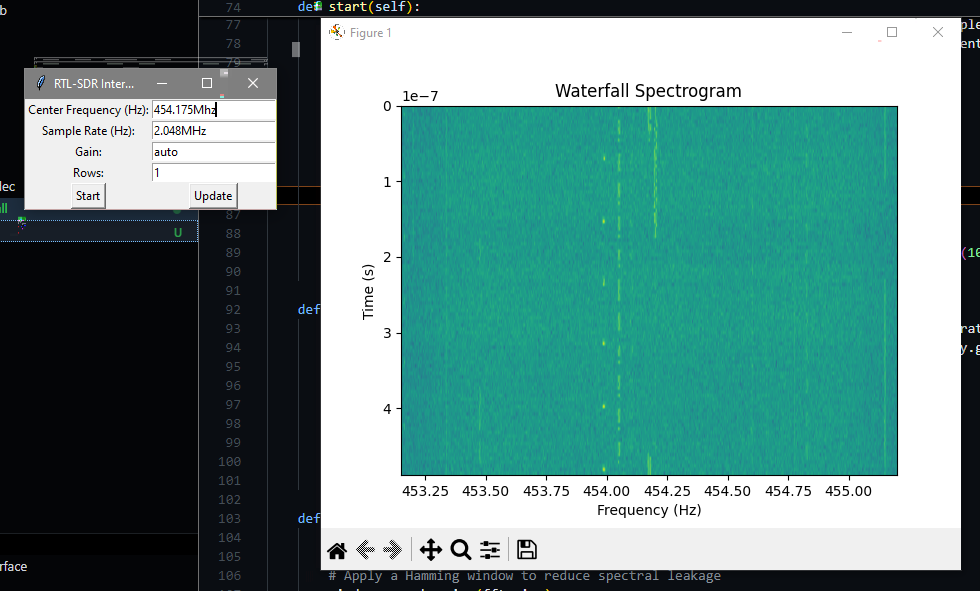

# RTL-SDR Waterfall Spectrogram

This application uses an RTL-SDR and Python to create a continuously scrolling waterfall spectrogram. The interface allows users to set the center frequency, sample rate, and gain, and displays the captured data in real-time.

## Features

- Real-time waterfall spectrogram display
- User-configurable center frequency, sample rate, and gain
- Continuous scrolling of spectrogram data

## Requirements

- Python 3.6 or higher
- RTL-SDR dongle
- Libraries:
  - `pyrtlsdr`
  - `numpy`
  - `matplotlib`
  - `tkinter`

Everything here was geneated by ChatGPT, aside from a few tweaks to the spectrum display. Please note there may be problems as this was just a test app.